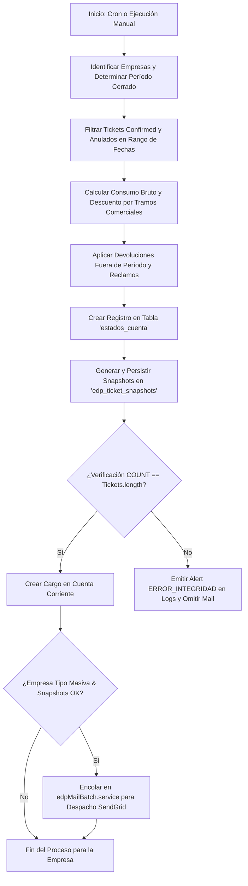

# Contexto de Desarrollo IA y Arquitectura - Sistema de Estados de Pago (EDP)

Este documento es la **fuente de verdad técnica** para desarrolladores e Inteligencias Artificiales. Describe de manera integral la arquitectura, flujo de ejecución, cálculo de descuentos, distribución de saldos, congelamiento de datos (snapshots) y despacho por correo electrónico del sistema de **Estados de Pago (EDP)**.

---

## 1. Módulos y Componentes del Sistema EDP

El sistema de Estados de Pago está compuesto por los siguientes componentes clave:

| Componente | Archivo principal | Descripción |
|---|---|---|
| **Cron Automático** | `src/cron/generarEstadosPagoEmpresas.ts` | Proceso periódico nocturno que evalúa y genera EDPs para períodos cerrados. |
| **Generación Manual** | `src/controllers/estadoCuenta.controller.ts` | Endpoint `POST /api/estados-cuenta/ejecutar-manual` para generar EDPs on-demand. |
| **Snapshot Engine** | Modelo `EdpTicketSnapshot` | Congela y persiste cada ticket y centro de costo asociado a un EDP en formato JSON inmutable. |
| **Mail Batch Dispatcher** | `src/services/edpMailBatch.service.ts` | Cola de despacho por correo (SendGrid) en lotes asíncronos para empresas de tipo `Masiva`. |
| **PDF & Excel Generators** | `src/services/pdf.service.ts`, `src/services/excel.service.ts` | Motores de renderizado de reportes consolidados y planillas de detalle. |

---

## 2. Flujo Completo de Generación de un EDP



---

## 3. Reglas de Negocio y Lógica Matemática de Saldos

### 3.1. Base de Cálculo y Consumo Bruto
1. **Tickets Confirmados ($G$)**: Suma de `monto_boleto` de tickets vigentes con `ticketStatus = "Confirmed"`.
2. **Devoluciones del Período ($D$)**: Suma de `monto_devolucion` de tickets anulados dentro del período.
3. **Monto Neto Base ($G$)**:
   $$\text{Monto Neto Base } (G) = \text{Monto Confirmados}$$
4. **Descuento por Tramos ($H$)**: Porcentaje determinado según los tramos comerciales asignados a la empresa (`empresa_tramos`).
   $$\text{Descuento por Tramos } (H) = \text{Math.round}\left(G \times \frac{\text{PorcentajeDescuento}}{100}\right)$$
5. **Monto Total EDP ($I$)**:
   $$\text{Monto Total EDP } (I) = \max(0, G - H)$$
6. **Monto EDP Final a Facturar ($J$)**:
   $$\text{Monto EDP Final } (J) = \max(0, I - E - F)$$
   *(donde $E$ representa Devoluciones de Períodos Anteriores y $F$ Descuentos por Reclamos).*

### 3.2. Devoluciones Fuera de Período y Reclamos Aceptados
Ocurren cuando un ticket de un mes anterior se anula en el mes en curso o cuando la empresa acumula créditos pendientes.

```typescript
let balance = monto_facturado_previo; // I

// 1. Aplicar Devoluciones Fuera de Período
if (balance >= totalDevolucionesFueraDisponibles) {
  devoluciones_fuera_periodo_aplicadas = totalDevolucionesFueraDisponibles;
  balance -= devoluciones_fuera_periodo_aplicadas;
  devoluciones_fuera_periodo_restante = 0;
} else {
  devoluciones_fuera_periodo_aplicadas = balance;
  devoluciones_fuera_periodo_restante = totalDevolucionesFueraDisponibles - devoluciones_fuera_periodo_aplicadas;
  balance = 0;
}

// 2. Aplicar Reclamos Aceptados Pendientes
if (balance >= reclamosDisponibles) {
  reclamos_aplicados = reclamosDisponibles;
  balance -= reclamos_aplicados;
  reclamos_restante = 0;
} else {
  reclamos_aplicados = balance;
  reclamos_restante = reclamosDisponibles - reclamos_aplicados;
  balance = 0;
}

const monto_facturado_final = balance;
```

### 3.3. Rollover / Saldos a Favor Restantes
Si el crédito supera la facturación del mes y `balance` llega a `$0`:
- El saldo no absorbido (`devoluciones_fuera_periodo_restante` y `reclamos_restante`) **no se pierde**.
- Se actualizan en la tabla `empresas` en los campos `devolucion_pendiente_edp` y `descuento_pendiente_edp` para ser arrastrados y descontados en el siguiente Estado de Pago.

---

## 4. Congelamiento Inmutable (Snapshots)

Para evitar que modificaciones posteriores en la base de datos (como la edición de un pasajero o cambio en un centro de costo) alteren el valor histórico de un EDP ya emitido:

1. **Estructura**: La tabla `edp_ticket_snapshots` almacena el `edp_id` y el campo `ticket_data` (LONGTEXT / JSON).
2. **Reintentos por Lotes (`bulkCreate`)**:
   - Se procesan en lotes de **500 en 500**.
   - Posee un mecanismo de hasta **3 reintentos con backoff exponencial** por cada lote para superar fluctuaciones de red en la BD.
3. **Verificación Estricta No Bloqueante (`SELECT COUNT(*)`)**:
   - Al finalizar la inserción, se ejecuta un `COUNT` en BD.
   - Si `countBD === tickets.length`, se valida la integridad como correcta.
   - Si `countBD !== tickets.length`, se emite una alerta roja en consola (`console.error`), se marca la bandera de error y **se omite el envío de correo de ese EDP** para evitar despachar un reporte incompleto. El proceso global no se bloquea y continúa con las demás empresas.

---

## 5. Despacho Masivo de Correos por SendGrid

El servicio `processEDPMailQueue` maneja la entrega automática de los EDPs:

1. **Filtro de Alcance**: Únicamente se envía a empresas con `tipo_facturacion = "Masiva"`.
2. **Destinatarios**: Combina `contacto_fact_email` y `ejecutivo_com_email`.
3. **Validación de Sintaxis Regex**:
   ```typescript
   const emailRegex = /^[^\s@]+@[^\s@]+\.[^\s@]+$/;
   ```
   Filtra automáticamente correos vacíos o strings descriptivos (como `"Sin Informacion"`), evitando rechazos o errores HTTP 400 por parte de SendGrid.
4. **Despacho por Chunks**: Envía en lotes concurrentes usando `Promise.allSettled` para aislar cualquier fallo individual sin interrumpir los demás correos.
5. **Adjuntos Generados en Memoria**: Construye en vivo el archivo `.pdf` consolidado y la planilla `.xlsx` con el detalle de tickets.
